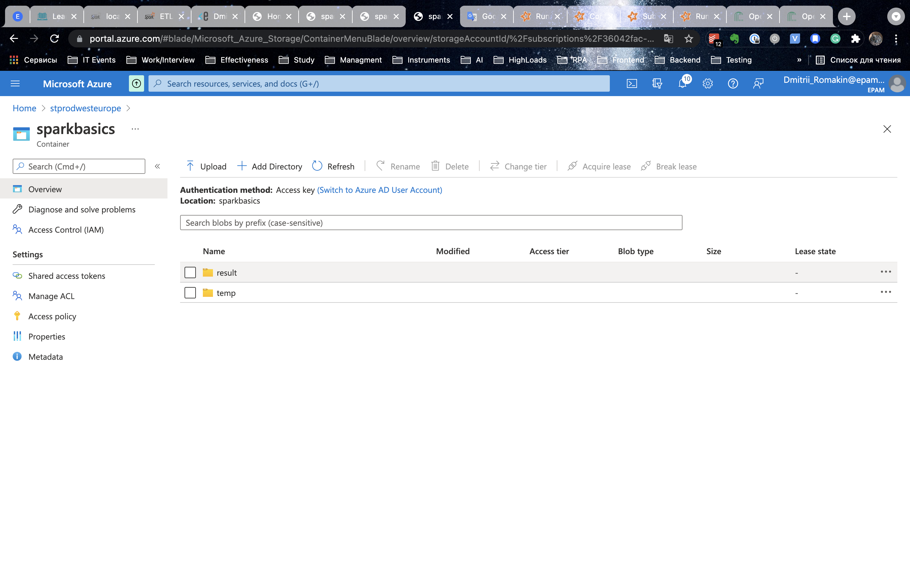

# Spark Basic Homework
## Original steps
* Fork jvm or python base of the project (please, preserve project naming).
* Data is in Azure ADLS gen2 storage. You can explore it, by connecting Storage Account in Azure Storage Explorer if needed, use this SAS URI in Azure Explorer.
* Create Spark etl job to read data from storage container. For this, you need to add special libraries like hadoop-azure and azure-storage into your project. Details are described here & here. Use ABFS drivers to connect and below OAuth credentials:

* Check hotels data on incorrect (null) values (Latitude & Longitude). For incorrect values map (Latitude & Longitude) from OpenCage Geocoding API in job on fly (Via REST API).
* Generate geohash by Latitude & Longitude using one of geohash libraries (like geohash-java) with 4-characters length in extra column.
* Left join weather and hotels data by generated 4-characters geohash (avoid data multiplication and make you job idempotent)
* Deploy Spark job on Azure Kubernetes Service (AKS), to setup infrastructure use terraform scripts from module. For this use Running Spark on Kubernetes deployment guide and corresponding to your spark version docker image. Default resource parameters (specifically memory) will not work because of free tier limitations. You needed to setup memory and cores properly.  Development and testing is recommended to do locally in your IDE environment.
* Store enriched data (joined data with all the fields from both datasets) in provisioned with terraform Azure ADLS gen2 storage preserving data partitioning in parquet format in “data” container (it marked with prevent_destroy=true and will survive terraform destroy).

## Project Structure

The following project structure will be used

```sh
.
├── README.md
├── requirements.txt
├── setup.py
├── docker
│   ├── azure_cluster
│   │   ├── Dockerfile
│   │   ├── entrypoint.sh
│   │   ├── environments
│   │   ├── spark-env.sh
│   │   └── spark-env.sh.template
├── src
│   └── main
│       └── python
│           ├── RemoteGroup
│           │   └── sparkJobRemoteRun.py
└── terraform
    ├── main.tf
    ├── terraform.plan
    ├── variables.tf
    └── versions.tf
```

## Python script with Spark Job
### RemoteGroup - Remote Data / Remote Run / Remote save result
If you want to run Spark Job on AKS using prebuild docker image, you can use:
* sparkJobRemoteRun.py

# Steps of homework
## AnalyseData
I analyse data using Jupyter Notebook:
* [SparkJob.ipynb](src/main/python/AnalyseData/SparkJob.ipynb)


## ENV in spark-env.sh

Before build docker image we need to create **spark-env.sh**.

Link: [spark-env.sh.template](docker/azure_cluster/spark-env.sh.template)

```bash
# env from task
ORIG_DATA_SPARK_BASICS_ADLS_SAS_URL=
AUTH_TYPE=OAuth
PROVIDER_TYPE=
CLIENT_ID=
CLIENT_SECRET=
CLIENT_ENDPOINT=

# env from terraform resource group
ABFS_CONNECTION_STRING=
STORAGE_ACCOUNT_NAME=
STORAGE_ACCOUNT_KEY=
STORAGE_CONNECTION_STRING=
STORAGE_LINK_STRING_ADLS_WRITE=
STORAGE_FILE_SYSTEM_NAME=
DATAFRAME_NAME=Final_df_hotel_weather
FINAL_DATAFRAME_DIR=Final_df_hotel_weather

# geocoder
GEOCODER_KEY=
```

## Steps of ETL Job
### 3 main steps:
* Working with hotels df
* Working with Weather df
* Inner Join hotels & weather df

### More details:
### 1. Load hotels data from ADLS Storage gen 2
```python
    df_hotels = load_df_hotels_from_adls(spark, ABFS_CONNECTION_STRING)
```

Original data saved in **csv.gz**

#### Hotels before fixing:


### 2. Fixing Latitude in hotels df
```python
    df_hotels_lat = fix_lat(spark, geocoder, df_hotels)
```
### 3. Fixing Longitude in hotels df
```python
    df_hotels_lat_lng = fix_lng(spark, geocoder, df_hotels_lat)
```
#### Hotels after fixing:


### 4. Calculate geohash for hotels using 2 columns: Latitude & Longitude
```python
    df_hotels_geohash = calc_geohash(spark, df_hotels_lat_lng, "hotels")
```

#### Hotels result of calculation geohash:


### 5. Load weather data from ADLS Storage gen 2
```python
    df_weather = load_df_weather_from_adls(spark, ABFS_CONNECTION_STRING)
```

#### Overview weather dataframe


### 6. Calculate geohash for weather using 2 columns: lat & lng
```python
    df_weather_geohash = calc_geohash(spark, df_weather, "weather")
```

#### Weather result of calculation geohash:


### 7. Filtering weather using hotels geohash list
```python
    df_hotels_geohash_list = [str(row['Geohash']) for row in df_hotels_geohash.collect()]
    df_weather_geohash_filter = df_weather_geohash.filter(df_weather_geohash.Geohash.isin(df_hotels_geohash_list))
```

#### Weather filter result:


### 8. Inner join filtering weather & hotels
```python
    result_df_inner = df_hotels_geohash.join(df_weather_geohash_filter, ["Geohash"])
```

#### Inner join result:


#### Inner join top 20 rows


#### Why so many duplicates in columns like Name, Country, etc.?
* There are several different locations weather measurements near the hotel for this geohash with its average temperature throughout the day, for this reason, we have duplicates in some of the columns.
* We decided to leave the repetition of the data, because the task of data science may be to train the model to predict the weather in a given region.
* Data for one day can show how the average temperature changed, and therefore the direction of the wind and other necessary indicators during the day.
* Different data in columns lng & lat show where the meteorological stations are located.
* You can also calculate the average number of measurements for 1 day.
* We can calculate the approximate favorable time of the year for a stopover in a given region so that hotel clients can enjoy the trip.


### 9. Create file system (container) using Azure SDK
```python
def adls_manager_create_container():
    service_client = DataLakeServiceClient(
        account_url="{}://{}.dfs.core.windows.net".format(
            "https",
            STORAGE_ACCOUNT_NAME
        ),
        credential=STORAGE_ACCOUNT_KEY
    )

    service_client.create_file_system(file_system=STORAGE_FILE_SYSTEM_NAME)
    service_client.close()
 
    
def main_spark_job():
    ...    
    adls_manager_create_container()
    ...
```

### 10. Write result to terraform storage ADLS gen 2
#### Write all in 1 file
```python
    # Write to adls container in 1 file:
    result_df_inner.coalesce(1).write.parquet(STORAGE_LINK_STRING_ADLS_WRITE)
```


#### Write all in many files without partitionBy
```python
    # Write parquet in many files:
    result_df_inner.write.parquet(STORAGE_LINK_STRING_ADLS_WRITE)
```

#### Write all with partitionBy
```python
    # Write result partition by year, month, day:
    result_df_inner.write.partitionBy("year", "month", "day").parquet(STORAGE_LINK_STRING_ADLS_WRITE)
```

It looks like:


## Read data & write using Spark
### Read
We can read data using spark.
To read data we need to set configurations in Spark session.
```python
session = SparkSession.builder \
.appName("ETL job") \
.getOrCreate()

session.conf.set("fs.azure.account.auth.type.<STORAGE_ACCOUNT_NAME>.dfs.core.windows.net", AUTH_TYPE)
session.conf.set("fs.azure.account.oauth.provider.type.<STORAGE_ACCOUNT_NAME>.dfs.core.windows.net", PROVIDER_TYPE)
session.conf.set("fs.azure.account.oauth2.client.id.<STORAGE_ACCOUNT_NAME>.dfs.core.windows.net", CLIENT_ID)
session.conf.set("fs.azure.account.oauth2.client.secret.<STORAGE_ACCOUNT_NAME>.dfs.core.windows.net", CLIENT_SECRET)
session.conf.set("fs.azure.account.oauth2.client.endpoint.<STORAGE_ACCOUNT_NAME>.dfs.core.windows.net", CLIENT_ENDPOINT)
# Connection to my adls storage
session.conf.set("fs.azure.account.key.<STORAGE_ACCOUNT_NAME>.dfs.core.windows.net", STORAGE_ACCOUNT_KEY)
```

### Write
We can write data using spark and ready to write dataframe.
```python
# Write to adls container
# coalesce(1) transform dataframe to 1 file
result_df_inner.coalesce(1).write.parquet(STORAGE_LINK_STRING_ADLS_WRITE)
```

## Find spark lib in docker image
I use special python package **findspark** that can find path to spark.
```python
import findspark
findspark.init()
```

## How to create filesystem to download/upload data to ADLS Storage
I create special function that use storage account name and key to create filesystem.
```python
def adls_manager_create_container():
    service_client = DataLakeServiceClient(
        account_url="{}://{}.dfs.core.windows.net".format(
            "https",
            STORAGE_ACCOUNT_NAME
        ),
        credential=STORAGE_ACCOUNT_KEY
    )

    service_client.create_file_system(file_system=STORAGE_FILE_SYSTEM_NAME)
    service_client.close()
```


## Tests
## [test_adls_source.py](src/test/test_adls_source.py)

### Download data using Azure SDK & Azure storage key
Let's try to download data from Azure ADLS Storage gen 2.

If we wnat download data from ADLS Storage we need to know full path to file and filename.

```python
def test_download_sparkbasics_adls_data():
    
    ...

    assert os.path.isfile(FILENAME)
```

### Create/Download/Upload data using Azure SDK & Azure storage key
Check all 5 steps:
* Create filesystem
* Create file
* Upload Data
* Download Data
* Delete filesystem

 ```python
def test_connection_download_upload_sparkbasics_adls_data():
    
    ...

    assert file_content == downloaded_bytes
```

### Test geocoder data
 ```python
def test_geocoder_key():
    geocoder = OpenCageGeocode(GEOCODER_KEY)
    results = geocoder.reverse_geocode(44.8303087, -0.5761911)
    assert len(results) == 1
```

## [test_spark.py](src/test/test_spark.py)
### Test fixing hotel lat - 2 step
 ```python
def test_main_fix_lat(spark, geocoder):
    ...
    df_hotels_lat = fix_lat(spark, geocoder, df_hotels)
    assert df_hotels_lat.filter(col("Latitude").isNull() | col("Latitude").rlike("NA")).count() == 0
```

### Test fixing hotel lng - 3 step
 ```python
def test_main_fix_lng(spark, geocoder):
    ...
    df_hotels_lat = fix_lng(spark, geocoder, df_hotels)
    assert df_hotels_lat.filter(col("Longitude").isNull() | col("Longitude").rlike("NA")).count() == 0
```

### Test calculating hotels geohash - 4 step
 ```python
def test_main_geohash_hotels(spark, geocoder):
    ...
    df_new_rdd = df_hotels_fixed.rdd
    df_rdd_new = df_new_rdd.map(lambda row: geohash_function_hotels(row))
    df_geohash = spark.createDataFrame(df_rdd_new)
    assert df_geohash.filter(col("Geohash").isNull() | col("Geohash").rlike("NA")).count() == 0
    assert df_geohash.filter(col("Geohash").isNotNull()).count() == 8
```

### Test calculating hotels geohash using multifunction - 4 step
 ```python
def test_main_geohash_multi_hotels(spark, geocoder):    
    ...
    df_hotels_geohash = calc_geohash(spark, df_hotels_lat_lng, "hotels")
    assert df_hotels_geohash.filter(col("Geohash").isNull() | col("Geohash").rlike("NA")).count() == 0
    assert df_hotels_geohash.filter(col("Geohash").isNotNull()).count() == 8
```

### Test calculating weather geohash using multifunction - 4 step
 ```python
def test_main_geohash_multi_weather(spark, geocoder):    
    ...
    df_geohash = calc_geohash(spark, df_weather, "weather")
    assert df_geohash.filter(col("Geohash").isNotNull()).count() == 8
```

### Test error check using multifunction - 4 step
 ```python
def test_main_geohash_multi_error_check(spark):
    ...
    try:
        calc_geohash(spark, df_weather, "error")
    except AssertionError:
        assert True, "Ok!"
    except:
        assert False, "Another error!"
```

### Test calculating weather geohash - 6 step
 ```python
def test_main_geohash_weather(spark):
    ...
    df_new_rdd = df_weather.rdd
    df_rdd_new = df_new_rdd.map(lambda row: geohash_function_weather(row))
    df_geohash = spark.createDataFrame(df_rdd_new)
    assert df_geohash.filter(col("Geohash").isNotNull()).count() == 8
```

### Test filtering before join - 7 step
 ```python
def test_main_filter_check(spark, geocoder):
    ...
    df_hotels_geohash = calc_geohash(spark, df_hotels_lat_lng, "hotels")
    ...
    df_weather_geohash = calc_geohash(spark, df_weather, "weather")

    # filtering weather data by geohash from hotels
    df_hotels_geohash_list = [str(row['Geohash']) for row in df_hotels_geohash.collect()]
    df_weather_geohash_filter = df_weather_geohash.filter(df_weather_geohash.Geohash.isin(df_hotels_geohash_list))

    assert df_weather_geohash_filter.count() == 4
```

### Test join - 8 step
 ```python
def test_main_join(spark, geocoder):
    ...
    # inner join
    result_df_inner = df_hotels_geohash.join(df_weather_geohash_filter, ["Geohash"])
    assert result_df_inner.count() == 4
    assert str(result_df_inner.schema.names) == str(['Geohash', 'Id', 'Name', 'Country', 'City', 'Address', 'Latitude',
                                                 'Longitude', 'lng', 'lat', 'avg_tmpr_f', 'avg_tmpr_c', 'wthr_date',
                                                 'year', 'month', 'day'])
```


# Remote cluster
## 1. Terraform
### Terraform: init
Steps:
* Create ADLS Storage gen 2 to deploy terraform plan to create special resources from plan on Azure.
* Terraform init with reconfigure.
```sh
terraform init -reconfigure \
    -backend-config="storage_account_name=<SET_DATA>" \
    -backend-config="container_name=<SET_DATA>" \
    -backend-config="access_key=<SET_DATA>" \
    -backend-config="key=prod.terraform.<MY_CONTAINER_NAME>"
```
### Terraform: other steps
```sh
terraform plan -out terraform.plan
terraform apply terraform.plan
....
```
### Destroy test env
```sh
terraform destroy
```
## 2. Connect ACR to AKS & get credentials
```sh
az aks update -n <AKS_NAME> -g <RESOURCE_GROUP_NAME> --attach-acr <ACR_NAME>
....
az aks get-credentials --resource-group <RESOURCE_GROUP_NAME> --name <AKS_NAME>
```
## 3. Create docker image and push it to ACR
To set env variables we can use special file in spark - **spark-env.sh**.

We can find template of this file in directory name - *conf*.

Before build docker image we need to create **spark-env.sh**.

Link: [spark-env.sh.template](docker/azure_cluster/spark-env.sh.template)

```sh
docker build --no-cache -t <YOUR_DOCKER_IMAGE_NAME>:<TAG_HERE> .
....
az acr login --name <ACR_NAME>
....
docker tag <YOUR_DOCKER_IMAGE_NAME>:<TAG_HERE> <ACR_NAME>.azurecr.io/<ACR_DOCKER_IMAGE_NAME>
docker push <ACR_NAME>.azurecr.io/<ACR_DOCKER_IMAGE_NAME>
```

Link: [Dockerfile](docker/azure_cluster/Dockerfile)

## 4. spark-submit
```sh
/usr/local/Cellar/apache-spark/3.1.2/bin/spark-submit \
        --master <LINK_TO_AKS> \
        --deploy-mode cluster \
        --name sparkbasics \
        --conf spark.executor.instances=1 \
        --conf spark.kubernetes.driver.cores=2 \
        --conf spark.kubernetes.executor.cores=2 \
        --conf spark.kubernetes.driver.memory=4g \
        --conf spark.kubernetes.executor.memory=4g \
        --conf spark.hadoop.fs.azure.account.key.<STORAGE_ACCOUNT_NAME>.dfs.core.windows.net=<STORAGE_ACCOUNT_KEY> \
        --conf spark.kubernetes.driver.container.image=<ACR_NAME>.azurecr.io/<ACR_DOCKER_IMAGE_NAME>:<TAG_HERE> \
        --conf spark.kubernetes.executor.container.image=<ACR_NAME>.azurecr.io/<ACR_DOCKER_IMAGE_NAME>:<TAG_HERE> \
        --conf spark.kubernetes.file.upload.path=abfss://<STORAGE_CONTAINER>@<STORAGE_ACCOUNT_NAME>.dfs.core.windows.net/<STORAGE_DIRECTORY> \
        your/path/to_your/file/from/project_root_folder
```
## 5. Monitoring
### AKS pod & live logs


### AKS pod finished


### AKS pod work result



## * **Optional**: Deploy using kuberbetes file
We can [convert docker-compose.yaml to manifest kubernetes file](https://kubernetes.io/docs/tasks/configure-pod-container/translate-compose-kubernetes/).
```sh
kompose convert
....
kubectl apply -f env-configmap.yaml,spark-master-service.yaml,spark-master-deployment.yaml,spark-worker-a-deployment.yaml
```

### Example
```sh
az acr import -n acrprodwesteuropesparkbasics --source docker.io/library/nginx:latest --image nginx:v1
az aks get-credentials -g rg-prod-westeurope -n aks-prod-westeurope
kubectl apply -f acr-nginx.yaml
kubectl get pods
```

## Links
* [Copy and transform data in Azure Data Lake Storage Gen2 using Azure Data Factory or Azure Synapse Analytics](https://docs.microsoft.com/en-us/azure/data-factory/connector-azure-data-lake-storage?tabs=data-factory)
* [Running Spark on Kubernetes](https://spark.apache.org/docs/latest/running-on-kubernetes.html#using-kubernetes-volumes)
* [Spark Configuration](http://spark.apache.org/docs/latest/configuration.html#environment-variables)
* [Submitting Applications](https://spark.apache.org/docs/latest/submitting-applications.html)
