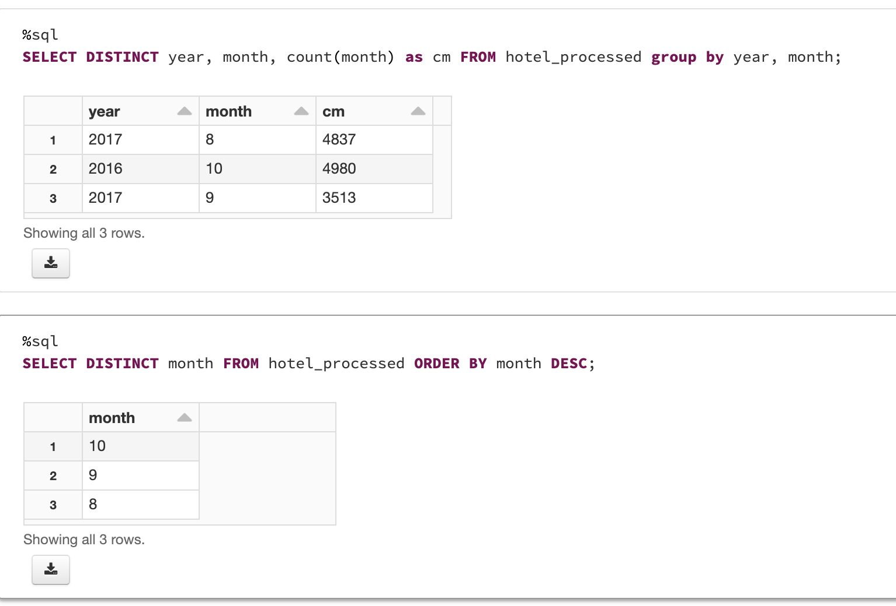
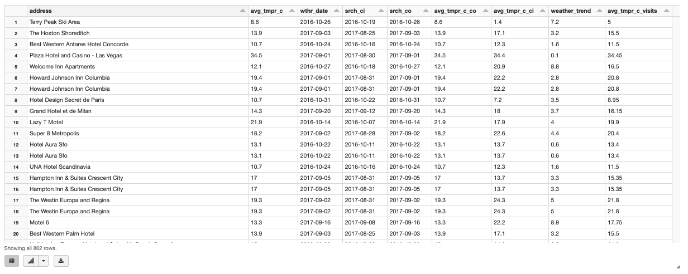

# Spark Basic Homework
## Original steps

* Fork jvm or python base of the project (please, preserve project naming).
* Copy hotel/weather and expedia data from Azure ADLS gen2 storage into provisioned with terraform Azure ADLS gen2 storage.
* Create Databricks Notebooks (Azure libraries like hadoop-azure and azure-storage are already part of Databricks environment, details are described here). Use ABFS drivers and OAuth credentials.
* Create delta tables based on data in storage account.
* Using Spark SQL calculate and visualize in Databricks Notebooks (for queries use hotel_id - join key, srch_ci- checkin, srch_co - checkout:
    1. Top 10 hotels with max absolute temperature difference by month.
    1. Top 10 busy (e.g., with the biggest visits count) hotels for each month. If visit dates refer to several months, it should be counted for all affected months.
    1. For visits with extended stay (more than 7 days) calculate weather trend (the day temperature difference between last and first day of stay) and average temperature during stay.
* For designed queries analyze execution plan. Map execution plan steps with real query. Specify the most time (resource) consuming part. For each analysis you could create tables with proper structure and partitioning if necessary.
* Deploy Databricks Notebook on cluster, to setup infrastructure use terraform scripts from module. Default resource parameters (specifically memory) will not work because of free tier limitations. You needed to setup memory and cores properly.
* Development and testing is recommended to do locally in your IDE environment with delta delta-core library.
* Store final DataMarts and intermediate data (joined data with all the fields from both datasets) in provisioned with terraform Azure ADLS gen2 storage preserving data partitioning in parquet format in “data” container (it marked with prevent_destroy=true and will survive terraform destroy).

## Project Structure

The following project structure will be used


```sh
.
├── README.md
├── notebooks
│   ├── MetadataCreate.sql
│   ├── sparksql.dbc
│   ├── sparksql.html
│   └── sparksql.ipynb
├── requirements.txt
├── setup.py
├── src
│   └── main
│       └── python
│           ├── __init__.py
│           └── sparksql.py
└── terraform
    ├── main.tf
    ├── terraform.plan
    ├── variables.tf
    └── versions.tf

```

# Steps of homework
I start working using Databrick.

## Deploy using terraform
```shell
terraform init -reconfigure \
    -backend-config="storage_account_name=m07" \
    -backend-config="container_name=sparksql" \
    -backend-config="access_key=<STORAGE_KEY>" \
    -backend-config="key=prod.terraform.sparksql"
terraform plan -out terraform.plan
terraform apply terraform.plan
....
terraform destroy
```
* Launch notebooks on Databricks cluster

## Data overview using Azure Storage Explorer
### core directory

### expedia - avro

### hotel-weather - parquet with partition by year, month, day


## Copy data from original ADLS to terraform ADLS Storage gen 2
### Copy data using Data Factory

### Create Data Factory


### Data Factory Configuration


### Data Factory run pipeline

### Copy result


## Working in Databrick's notebook

## Notebook in html
* [sparksql.html](./notebooks/sparksql.html)

### Configure Databrick's spark


### Create container to upload result and temp data


### Create Parquet Table
The same action for hotels-weather table.


### Create Delta Table using Parquet Table
The same action for hotels-weather table.


## Analyse data using sql
### task 1: Top 10 hotels with max absolute temperature difference by month


### Result task 1
#### Table

#### Plot


### task 2: Top 10 busy (e.g., with the biggest visits count) hotels for each month. If visit dates refer to several months, it should be counted for all affected months.
#### Sort without join tables use only hotel_id (without partitioning by year)


### Result task 2
#### Table

#### Plot


### task 3: For visits with extended stay (more than 7 days) calculate weather trend (the day temperature difference between last and first day of stay) and average temperature during stay.
#### Analyse data and try to understand how to get data of last and first day


#### Get data of last and first day by creating new columns


#### Let's calculate data separatly and then join them


### Result task 3

#### Table

#### Plot


## Save result in ADLS Storage gen 2
### task 1


### task 2


### task 3


### Save joined data with all the fields from both datasets


### temp df


## Overview results in ADLS Storage gen 2


### task 1


### task 2


### task 3


### temp df


## Overview executions plans

### Task 1


### Task 2


### Task 3


