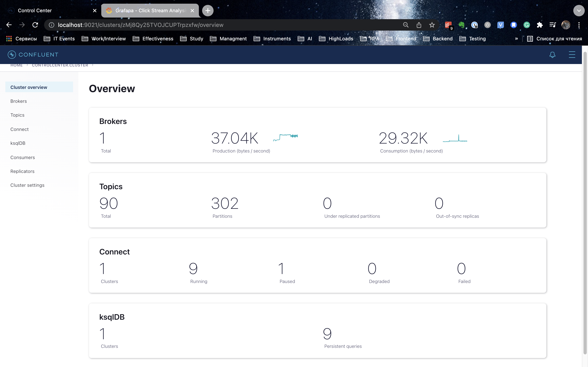
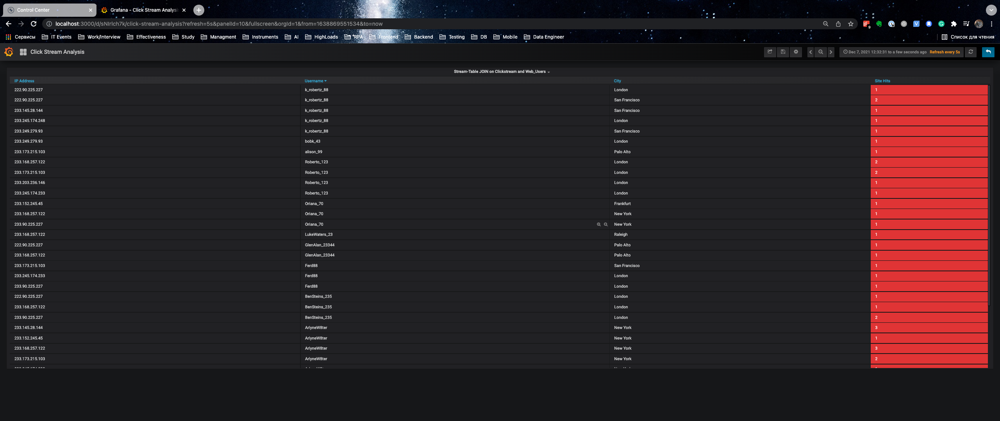

# Kafka Basics Homework
## Description 
This module needs to be done locally. To learn basic Kafka operations, please, complete this quickstart guide (STEPS 1-5).
After you learn Kafka basics proceed with rest of Kafka utilities.
Fork base of the project (please, preserve project naming) and proceed with Clickstream Data Analysis Pipeline Using KSQL (Docker) tutorial.
Tutorial focuses on building real-time analytics of users to determine:

* General website analytics, such as hit count and visitors
* Bandwidth use
* Mapping user-IP addresses to actual users and their location
* Detection of high-bandwidth user sessions
* Error-code occurrence and enrichment
* Sessionization to track user-sessions and understand behavior (such as per-user-session-bandwidth, per-user-session-hits etc)
* The tutorial uses standard streaming functions (i.e., min, max, etc) and enrichment using child tables, stream-table join, and different types of windowing functionality.

### Expected results
* Repository with Docker, configuration scripts, application sources and etc.
* Upload in task Readme MD file with link on repo, fully documented homework with screenshots and comments.

# Steps of homework
## Docker Desktop
### Raise up to 8 gb RAM in Docker Desktop


## Download images using terminal
It brings together several Docker images with the required networking and dependencies.

The images are quite large and depending on your network connection may take 10-15 minutes to download.

```bash
docker run -v $PWD/confluent-hub-components:/share/confluent-hub-components confluentinc/ksqldb-server:0.8.0 confluent-hub install --no-prompt confluentinc/kafka-connect-datagen:0.4.0
docker run -v $PWD/confluent-hub-components:/share/confluent-hub-components confluentinc/ksqldb-server:0.8.0 confluent-hub install --no-prompt confluentinc/kafka-connect-elasticsearch:10.0.2
```

Then try to run:
```bash
docker-compose up -d
```

## Solving ElasticSearch problem
### Error description
If we run original docker-compose, we get error like this:
```bash
ERROR: [1] bootstrap checks failed. You must address the points described in the following [1] lines before starting Elasticsearch.

bootstrap check failure [1] of [1]: the default discovery settings are unsuitable for production use; at least one of [discovery.seed_hosts, discovery.seed_providers, cluster.initial_master_nodes] must be configured

ERROR: Elasticsearch did not exit normally - check the logs at /usr/share/elasticsearch/logs/docker-cluster.log
```

### How to solve this issue?
Steps:
1. Change docker-compose file up version 2.2
1. Change image to 6.8.20 or 7.14
1. Add some more environments (bootstrap.memory_lock=true, etc)
1. Add ulimits + memlock

### Helpful links with this problem
1. [https://github.com/elastic/elasticsearch/issues/43911](https://github.com/elastic/elasticsearch/issues/43911)
1. [https://hub.docker.com/_/elasticsearch?tab=tags](https://hub.docker.com/_/elasticsearch?tab=tags)
1. [https://www.elastic.co/guide/en/elasticsearch/reference/6.8/docker.html](https://www.elastic.co/guide/en/elasticsearch/reference/6.8/docker.html)

## Run fixed docker-compose
```bash
docker-compose up -d
```


## Create the Clickstream Data
### Launch the ksqlDB CLI and check the ksqlDB server is ready to receive requests


### Run the script create-connectors.sql
It executes the ksqlDB statements to create three source connectors for generating mock data


### Check topics & simulating the stream of clicks & data generator run for the HTTP status codes & 


## Confluent Control Center UI
### Go to Confluent Control Center UI at [http://localhost:9021](http://localhost:9021)



## Load the Streaming Data to ksqlDB
### Load the statements.sql file that runs the tutorial app


## Verify the data on Confluent Control Center UI
### View the ksqlDB view Flow


### Query one of the streams CLICKSTREAM:
```sql
select * from CLICKSTREAM emit changes;
```


## Load the Clickstream Data in Grafana
Send the ksqlDB tables to Elasticsearch and Grafana.

### Set up the required Elasticsearch document mapping template


```bash
docker-compose exec elasticsearch bash -c '/scripts/elastic-dynamic-template.sh'

...

docker-compose exec ksqldb-server bash -c '/scripts/ksql-tables-to-grafana.sh'

...
```
### Permission denied


### Solve this problem using chmod


### Grafana dashboard


### Running connectors
 The three kafka-connect-datagen source connectors were created with the ksqlDB CLI, and the seven Elasticsearch sink connectors were created with the ksqlDB REST API.


## Sessionize the data
### Run special script
One of the tables created by the demo, CLICK_USER_SESSIONS, shows a count of user activity for a given user session.

All clicks from the user count towards the total user activity for the current session.

If a user is inactive for 30 seconds, then any subsequent click activity is counted towards a new session.

The clickstream demo simulates user sessions with a script.

The script pauses the DATAGEN_CLICKSTREAM connector every 90 seconds for a 35 second period of inactivity.

By stopping the DATAGEN_CLICKSTREAM connector for some time greater than 30 seconds, you will see distinct user sessions.

```bash
./sessionize-data.sh
```


A few moments later...


## Results


## Tasks
### General website analytics, such as hit count and visitors & Detection of high-bandwidth user sessions


### Bandwidth use


### Mapping user-IP addresses to actual users and their location


### Error-code occurrence and enrichment


### Sessionization to track user-sessions and understand behavior (such as per-user-session-bandwidth, per-user-session-hits etc)


## Links
1. [Clickstream Data Analysis Pipeline Using ksqlDB](https://docs.confluent.io/platform/current/tutorials/examples/clickstream/docs/index.html?utm_source=github&utm_medium=demo&utm_campaign=ch.examples_type.community_content.clickstream)
1. [Original confluentinc Github branch](https://github.com/confluentinc/examples)
1. [Clickstream readme](https://github.com/confluentinc/examples/blob/7.0.0-post/clickstream/README.md)
1. [documentation for running this example and its accompanying tutorial](https://docs.confluent.io/platform/current/tutorials/examples/clickstream/docs/index.html?utm_source=github&utm_medium=demo&utm_campaign=ch.examples_type.community_content.clickstream)

