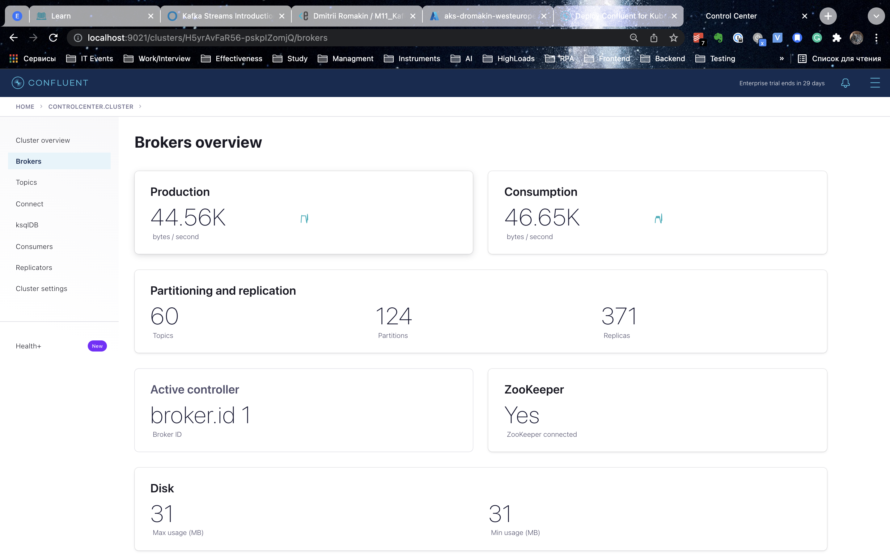
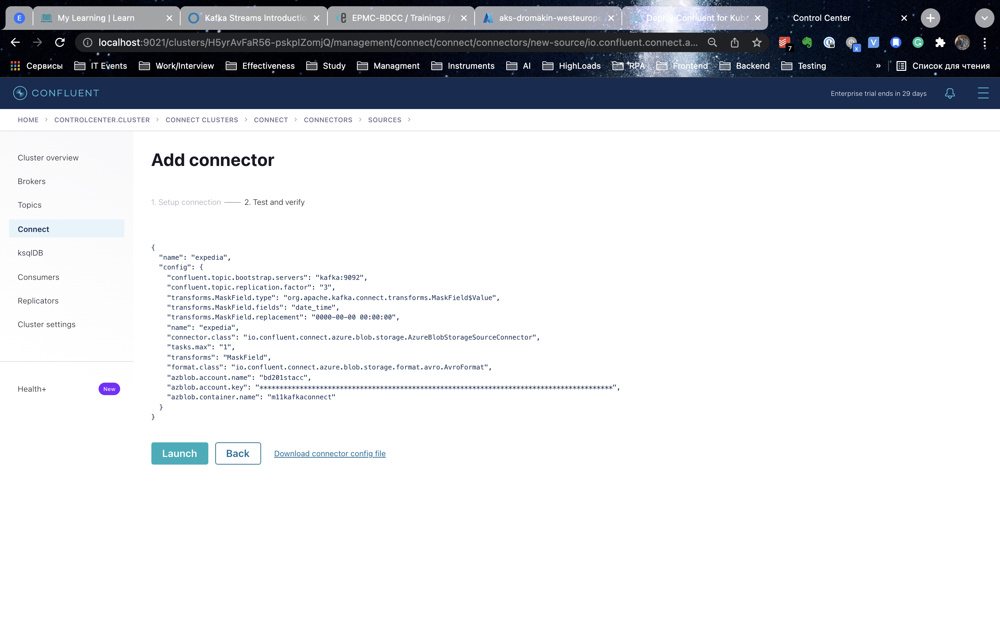

# Kafka connect in Kubernetes
## Description
* Deploy Azure Kubernetes Service (AKS) and Azure Storage Account, to setup infrastructure use terraform scripts from module. Kafka will be deployed in AKS, use Confluent Operator and Confluent Platform for this (Confluent for Kubernetes).
* Modify Kafka Connect to read data from storage container into Kafka topic (expedia). Use this tutorial (Azure Blob Storage Source Connector for Confluent Platform) and credentials
* Before uploading data into Kafka topic, please, mask time from the date field using MaskField transformer like: 2015-08-18 12:37:10 -> 0000-00-00 00:00:00

### Expected results
* Repository with Docker, configuration scripts, application sources and etc.
* Upload in task Readme MD file with link on repo, fully documented homework with screenshots and comments.

## Steps
## Data overview


## Set up Azure infrastructure
### Login to Azure
```cmd
  az login
```


### Create Azure infrastructure using terraform
### Terraform: init
Steps:
* Create ADLS Storage gen 2 to deploy terraform plan to create special resources from plan on Azure.
* Terraform init with reconfigure.
```sh
terraform init -reconfigure \
    -backend-config="storage_account_name=<SET_DATA>" \
    -backend-config="container_name=<SET_DATA>" \
    -backend-config="access_key=<SET_DATA>" \
    -backend-config="key=prod.terraform.<MY_CONTAINER_NAME>"
```


### Terraform: other steps
```sh
terraform plan -out terraform.plan
terraform apply terraform.plan
....
```
### Destroy env
```sh
terraform destroy
```
## Connect ACR to AKS & get credentials


```sh
az aks update -n <AKS_NAME> -g <RESOURCE_GROUP_NAME> --attach-acr <ACR_NAME>
....
az aks get-credentials --resource-group <RESOURCE_GROUP_NAME> --name <AKS_NAME>
```

## Create a custom docker image with Confluent Hub Client
### Add the following content to the Dockerfile: (OPTIONAL)
```sh
RUN mkdir -p /opt/confluent-hub-client \
    && curl "http://client.hub.confluent.io/confluent-hub-client-latest.tar.gz" \
    | tar -xzv -C /opt/confluent-hub-client

ENV PATH="/opt/confluent-hub-client/bin:${PATH}"

```
### Create docker image and push it to ACR


```sh
docker build --no-cache -t <YOUR_DOCKER_IMAGE_NAME>:<TAG_HERE> -f connectors/Dockerfile connectors
....
az acr login --name <ACR_NAME>
....
docker tag <YOUR_DOCKER_IMAGE_NAME>:<TAG_HERE> <ACR_NAME>.azurecr.io/<ACR_DOCKER_IMAGE_NAME>
docker push <ACR_NAME>.azurecr.io/<ACR_DOCKER_IMAGE_NAME>
```

## Install Confluent Hub Client

You can find the installation manual [here](https://docs.confluent.io/home/connect/confluent-hub/client.html)

## Launch Confluent for Kubernetes

### Create a namespace

- Create the namespace to use:

  ```cmd
  kubectl create namespace confluent
  ```

- Set this namespace to default for your Kubernetes context:

  ```cmd
  kubectl config set-context --current --namespace confluent
  ```

### Install Confluent for Kubernetes

- Add the Confluent for Kubernetes Helm repository:

  ```cmd
  helm repo add confluentinc https://packages.confluent.io/helm
  helm repo update
  ```

- Install Confluent for Kubernetes:

  ```cmd
  helm upgrade --install confluent-operator confluentinc/confluent-for-kubernetes --namespace confluent
  ```


### Install Confluent Platform


- Install all Confluent Platform components:

  ```cmd
  kubectl apply -f ./confluent-platform.yaml
  ```

- Install a sample producer app and topic:

  ```cmd
  kubectl apply -f ./producer-app-data.yaml
  ```

- Check that everything is deployed:

  ```cmd
  kubectl get pods -o wide
  ```

### View Control Center

- Set up port forwarding to Control Center web UI from local machine:

  ```cmd
  kubectl port-forward controlcenter-0 9021:9021
  ```

- Browse to Control Center: [http://localhost:9021](http://localhost:9021)





## Create a kafka topic

- The topic should have at least 3 partitions because the azure blob storage has 3 partitions. Name the new topic: "expedia".


## Prepare the azure connector configuration
  ```
  "name": "expedia",
  "connector.class" : "io.confluent.connect.azure.blob.storage.AzureBlobStorageSourceConnector",
  "tasks.max" : "1",
  "azblob.account.name" : "bd201stacc",
  "azblob.account.key" : "********",
  "azblob.container.name" : "m11kafkaconnect",
  "format.class" : "io.confluent.connect.azure.blob.storage.format.avro.AvroFormat",
  "confluent.topic.bootstrap.servers" : "kafka:9071",
  "confluent.topic.replication.factor" : "3",
  "transforms": "DateTimeMask",
  "transforms.DateTimeMask.type": "org.apache.kafka.connect.transforms.MaskField$Value",
  "transforms.DateTimeMask.fields": "date_time",
  "transforms.DateTimeMask.replacement": "0000-00-00 00:00:00"
  ```

## Upload the connector file through the API





## Result in topic


