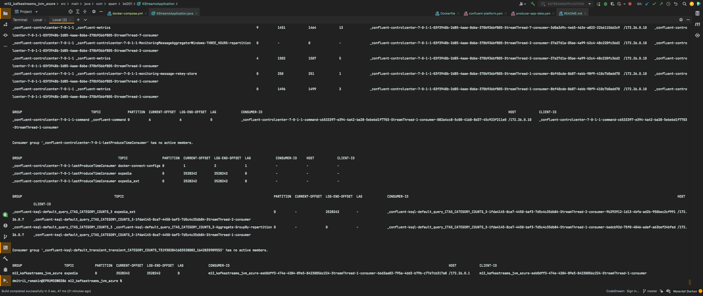
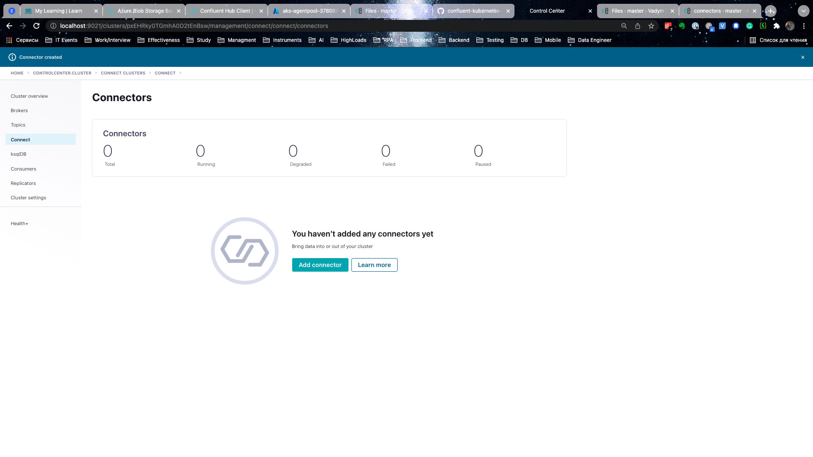

# Kafka connect in Kubernetes
## Description
* Write Kafka Streams job to read data from Kafka topic (expedia) and calculate customer's duration of stay as days between requested check-in (srch_ci) and check-out (srch_o) date. Use underling logic to setup proper category.
  * "Erroneous data": null, less than or equal to zero
  * "Short stay": 1-4 days
  * "Standard stay": 5-10 days
  * "Standard extended stay": 11-14 days
  * "Long stay": 2 weeks plus
* Store enriched data in Kafka topic (expedia_ext). Visualized data in Kafka topic (expedia_ext) with KSQL. Show total amount of hotels (hotel_id) and number of distinct hotels (hotel_id) for each category.

### Expected results
* Repository with Docker, configuration scripts, application sources and etc.
* Upload in task Readme MD file with link on repo, fully documented homework with screenshots and comments.

## Steps
## Data overview


Data description: [DataDescription.md](data/DataDescription.md)

## Local set up docker-compose infrastructure & running
### 1. create docker-compose.yaml & running
[docker-compose.yml](docker-compose.yml)


Run it:
```cmd
  docker-compose up
```


### 2. Create topics


### 3. Create python script to download data and load the .avro data inside Kafka "expedia" topic
Python script with Kafka & Spark ETL Job: [sparkAvroTransfer.py](src/main/python/SparkAvroTransfer/sparkAvroTransfer.py)

Run it:


Check expedia topic from console:


Check expedia_ext topic from console: (must be empty):


Check Confluent:


### 4. Create KStreamsApplication
App: [KStreamsApplication](src/main/java/com/epam/bd201/KStreamsApplication.java)

- Build KStream application jar
  ```cmd
  $ mvn package
  ```


Run it:


Check expedia_ext topic from console: (must be empty):


Check Confluent:


### 5. Run ksql


### 6. Checking the offset


### 7. Result
Locally all works fine!
But in Azure I have some troubles, see below.

## Set up Azure infrastructure
### Login to Azure
```cmd
  az login
```

### Create Azure infrastructure using terraform
### Terraform: init
Steps:
* Create ADLS Storage gen 2 to deploy terraform plan to create special resources from plan on Azure.
* Terraform init with reconfigure.
```sh
terraform init -reconfigure \
    -backend-config="storage_account_name=<SET_DATA>" \
    -backend-config="container_name=<SET_DATA>" \
    -backend-config="access_key=<SET_DATA>" \
    -backend-config="key=prod.terraform.<MY_CONTAINER_NAME>"
```

### Terraform: other steps
```sh
terraform plan -out terraform.plan
terraform apply terraform.plan
....
```
### Destroy env
```sh
terraform destroy
```
## Connect ACR to AKS & get credentials

```sh
az aks update -n <AKS_NAME> -g <RESOURCE_GROUP_NAME> --attach-acr <ACR_NAME>
....
az aks get-credentials --resource-group <RESOURCE_GROUP_NAME> --name <AKS_NAME>
```

## Create a custom docker image with Confluent Hub Client
### Add the following content to the Dockerfile: (OPTIONAL)
```sh
RUN mkdir -p /opt/confluent-hub-client \
    && curl "http://client.hub.confluent.io/confluent-hub-client-latest.tar.gz" \
    | tar -xzv -C /opt/confluent-hub-client

ENV PATH="/opt/confluent-hub-client/bin:${PATH}"

```
### Create docker image and push it to ACR

```sh
docker build --no-cache -t <YOUR_DOCKER_IMAGE_NAME>:<TAG_HERE> -f connectors/Dockerfile connectors
....
az acr login --name <ACR_NAME>
....
docker tag <YOUR_DOCKER_IMAGE_NAME>:<TAG_HERE> <ACR_NAME>.azurecr.io/<ACR_DOCKER_IMAGE_NAME>
docker push <ACR_NAME>.azurecr.io/<ACR_DOCKER_IMAGE_NAME>
```


## Install Confluent Hub Client

You can find the installation manual [here](https://docs.confluent.io/home/connect/confluent-hub/client.html)

## Create a custom docker image

For running the azure connector, you can create your own docker image. Create your azure connector image and build it.

## Launch Confluent for Kubernetes

### Create a namespace

- Create the namespace to use:

  ```cmd
  kubectl create namespace confluent
  ```

- Set this namespace to default for your Kubernetes context:

  ```cmd
  kubectl config set-context --current --namespace confluent
  ```

### Install Confluent for Kubernetes

- Add the Confluent for Kubernetes Helm repository:

  ```cmd
  helm repo add confluentinc https://packages.confluent.io/helm
  helm repo update
  ```

- Install Confluent for Kubernetes:

  ```cmd
  helm upgrade --install confluent-operator confluentinc/confluent-for-kubernetes
  ```

### Install Confluent Platform

- Install all Confluent Platform components:

  ```cmd
  kubectl apply -f ./confluent-platform.yaml
  ```

- Install a sample producer app and topic:

  ```cmd
  kubectl apply -f ./producer-app-data.yaml
  ```

- Check that everything is deployed:

  ```cmd
  kubectl get pods -o wide 
  ```


### View Control Center

- Set up port forwarding to Control Center web UI from local machine:

  ```cmd
  kubectl port-forward controlcenter-0 9021:9021
  ```

- Browse to Control Center: [http://localhost:9021](http://localhost:9021)


## Create a kafka topic

- The topic should have at least 3 partitions because the azure blob storage has 3 partitions. Name the new topic: "expedia".


## Prepare the azure connector configuration




### After updating website:


### Create one more time connector:


### No connectors found!
What is that? ....

### Try to fix it
But if we run this command:
1. port forward
  ```cmd
  $ kubectl port-forward connect-0 8083:8083
  ```
2. restart connector
  ```cmd
  $ curl -s -XPOST "http://localhost:8083/connectors/expedia_test/restart"
  ```

Whe get error 500.

### Open Confluent website:


### How to fix this bug?
We need to create 3 nodes with 4 cpu and 8 gb ram 


More information here:
* [System Requirements](https://docs.confluent.io/5.4.1/installation/system-requirements.html#system-requirements)
* [Sizing recommendations](https://docs.confluent.io/5.4.1/installation/operator/co-env-capacity.html#sizing-recommendations)
* [Example deployments](https://docs.confluent.io/platform/current/control-center/installation/configure-control-center.html#example-deployments)
* [Supported Versions and Interoperability](https://docs.confluent.io/platform/current/installation/versions-interoperability.html#supported-versions-and-interoperability)

## Upload the connector file through the API

## Implement you KStream application

- Add necessary code and configuration to [KStream Application Class](src/main/java/com/epam/bd201/KStreamsApplication.java)

- Build KStream application jar
  ```cmd
  $ mvn package
  ```

- Build [KStream Docker Image](Dockerfile) - insert valid Azure image registry here
  ```cmd
  $ docker build -t image-registry/your-project-id/kstream-app:1.0
  ```

- Push KStream image to Container Registry
  ```cmd
  $ docker push image-registry/your-project-id/kstream-app:1.0
  ```

- Run you KStream app container in the K8s kluster alongside with Kafka Connect. Don't forger to update [Kubernetes deployment](kstream-app.yaml)
  with valid registry for your image
  ```cmd
  $ kubectl create -f kstream-app.yaml
  ```


## Links
* [Confluent REST API](https://developer.confluent.io/learn-kafka/kafka-connect/rest-api/)
* [Deploy Confluent Platform](https://github.com/confluentinc/confluent-kubernetes-examples/tree/master/quickstart-deploy)
* [Spark deploy with packages](https://spark.apache.org/docs/latest/sql-data-sources-avro.html#deploying)
* [PySpark unable to read Avro file local from Pycharm](https://stackoverflow.com/questions/69818488/pyspark-unable-to-read-avro-file-local-from-pycharm)
* [How to submit multiple jars to workers through sparkSession?](https://stackoverflow.com/questions/46076771/how-to-submit-multiple-jars-to-workers-through-sparksession)
* [Class org.apache.hadoop.fs.azurebfs.SecureAzureBlobFileSystem not found](https://stackoverflow.com/questions/66421569/java-lang-classnotfoundexception-class-org-apache-hadoop-fs-azurebfs-secureazur)
* [Provided Maven Coordinates must be in the form 'groupId:artifactId:version' PySpark and Kafka](https://stackoverflow.com/questions/62347237/provided-maven-coordinates-must-be-in-the-form-groupidartifactidversion-pysp)

