# Spark Streaming Homework
## Description
* Organize incremental copy of hotel/weather data from Azure ADLS gen2 storage into provisioned with terraform Azure ADLS gen2 storage (with a delay, one day per cycle).
* Create Databricks Notebooks (Azure libraries like hadoop-azure and azure-storage are already part of Databricks environment, details are described here). Use ABFS drivers and OAuth credentials like below:
* Create Spark Structured Streaming application with Auto Loader to incrementally and efficiently processes hotel/weather data as it arrives in provisioned Azure ADLS gen2 storage. Using Spark calculate in Databricks Notebooks for each city each day:
    * Number of distinct hotels in the city.
    * Average/max/min temperature in the city.
* Visualize incoming data in Databricks Notebook for 10 biggest cities (the biggest number of hotels in the city, one chart for one city):
    * X-axis: date (date of observation).
    * Y-axis: number of distinct hotels, average/max/min temperature.
* Deploy Databricks Notebook on cluster, to setup infrastructure use terraform scripts from module. Default resource parameters (specifically memory) will not work because of free tier limitations. You needed to setup memory and cores properly.


### Expected results
* Repository with notebook (with output results), configuration scripts, application sources, execution plan dumps, analysis and etc.
* Upload in task Readme MD file with link on repo, fully documented homework with screenshots and comments.


## Steps
## Data overview
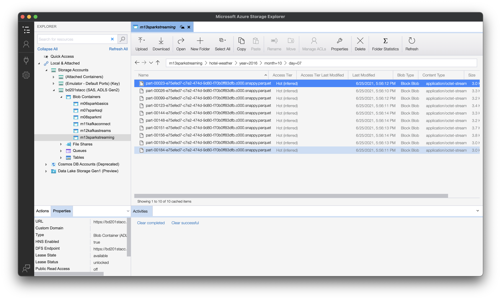

## Set up Azure infrastructure
### Login to Azure
```cmd
  az login
```

### Create Azure infrastructure using terraform
### Terraform: init
Steps:
* Create ADLS Storage gen 2 to deploy terraform plan to create special resources from plan on Azure.
* Terraform init with reconfigure.
```sh
terraform init -reconfigure \
    -backend-config="storage_account_name=<SET_DATA>" \
    -backend-config="container_name=<SET_DATA>" \
    -backend-config="access_key=<SET_DATA>" \
    -backend-config="key=prod.terraform.<MY_CONTAINER_NAME>"
```

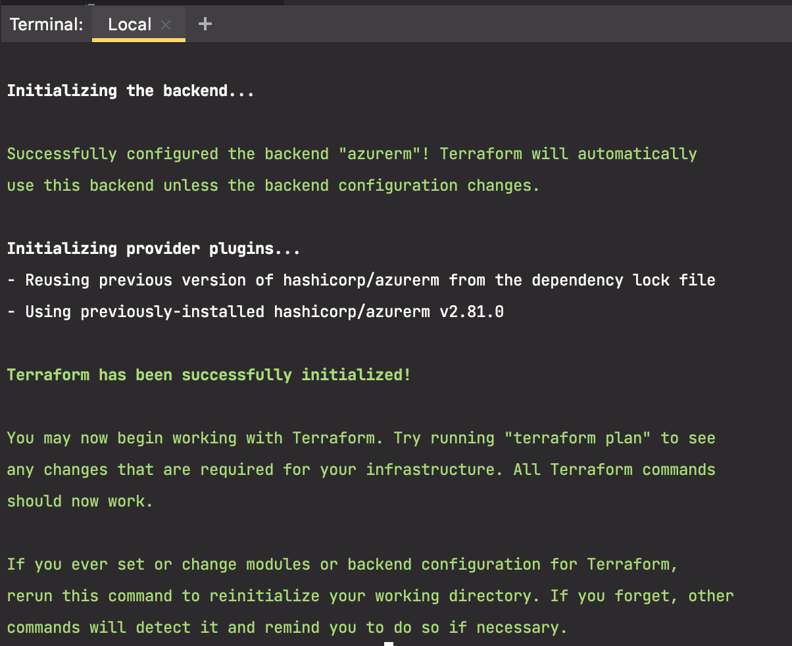

### Terraform: other steps
```sh
terraform plan -out terraform.plan
terraform apply terraform.plan
....
```

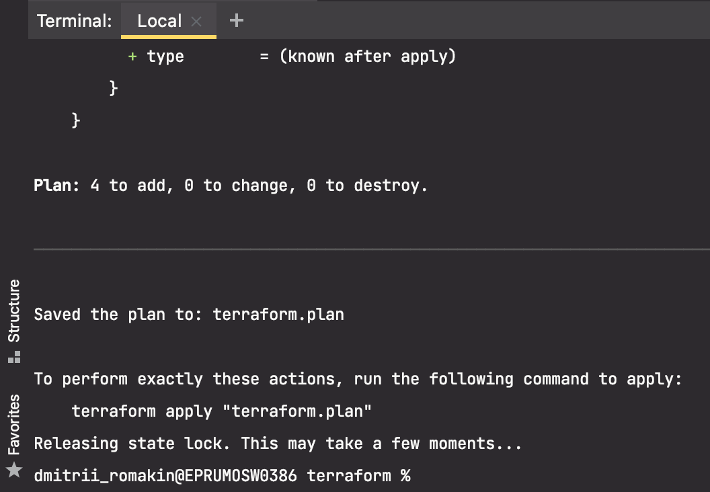
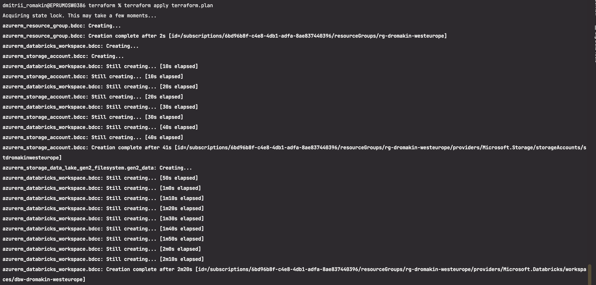

### Destroy env
```sh
terraform destroy
```

## Login to DataBricks and create a new cluster

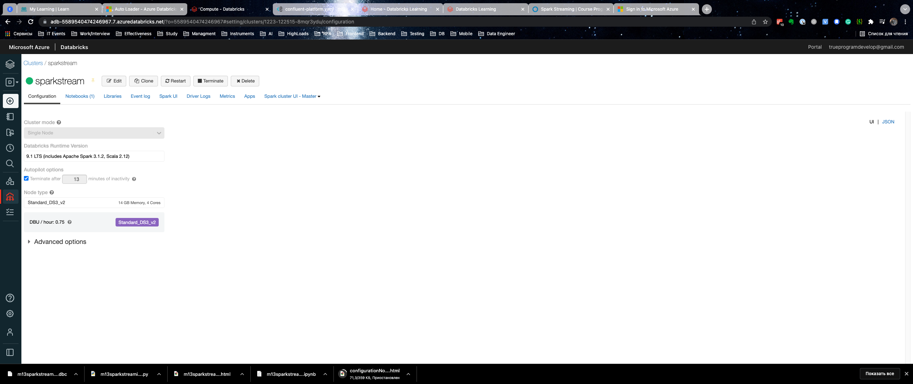

## Create new notebook using import
Link to file:
* [m13sparkstreaming_python_azure.html](notebooks/m13sparkstreaming_python_azure.html)
* [m13sparkstreaming_python_azure.ipynb](notebooks/m13sparkstreaming_python_azure.ipynb)
* [m13sparkstreaming_python_azure.dbc](notebooks/m13sparkstreaming_python_azure.dbc)

## Run notebook commands one by one
### Reading input data and running bronze stream
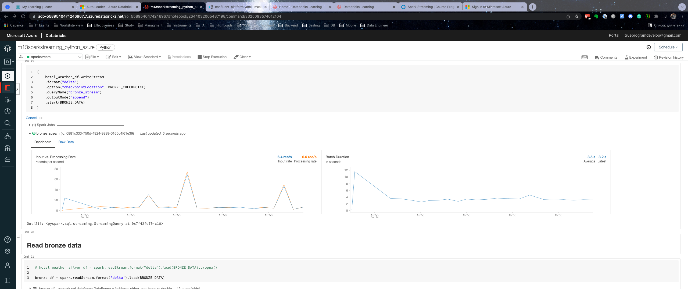
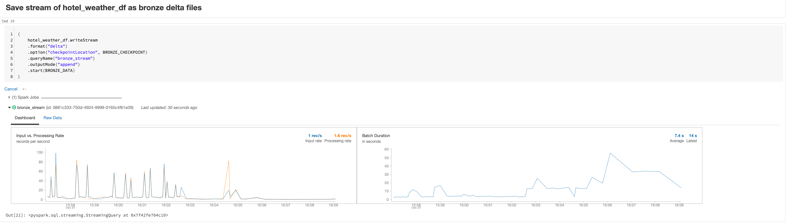

### Transform bronze data
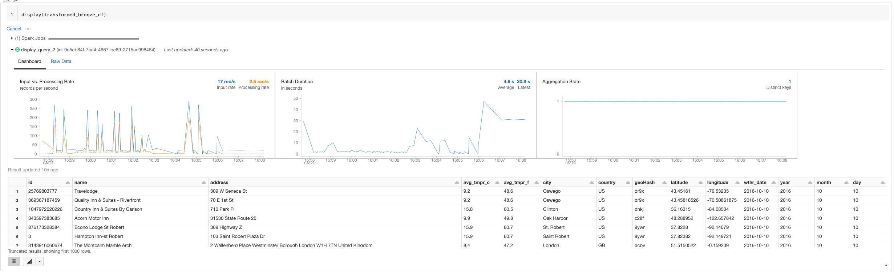

### Running Silver stream
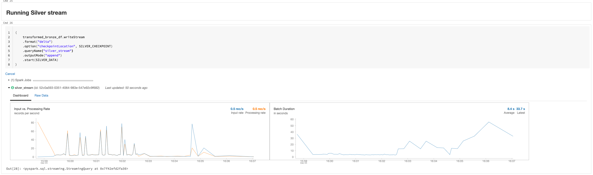

### Running Gold stream
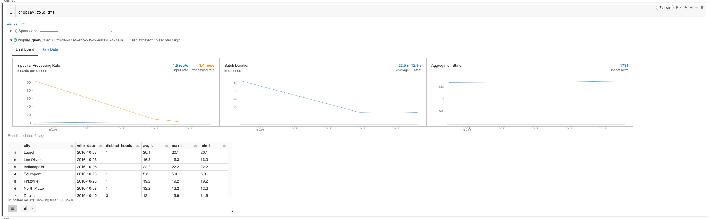
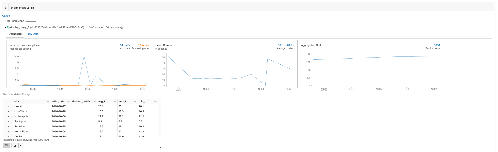

### Save gold data as delta files
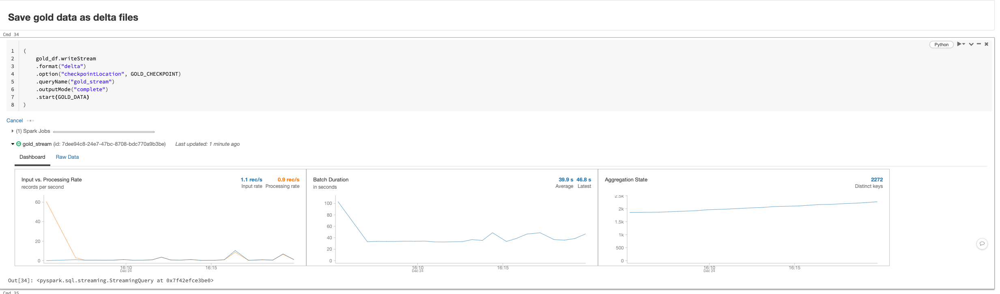

## Using Spark calculate in Databricks Notebooks for each city each day
* Number of distinct hotels in the city.
* Average/max/min temperature in the city.

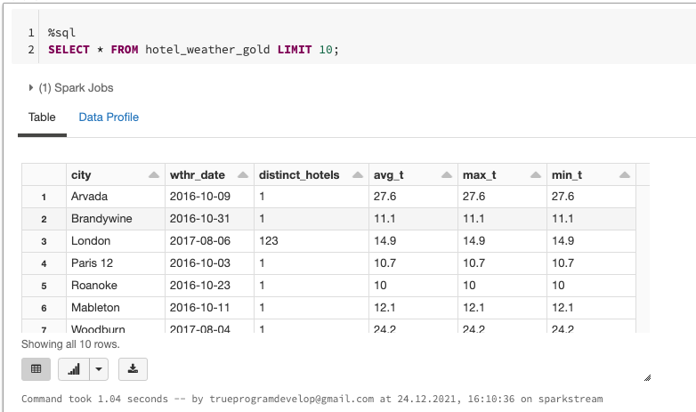

## Visualize incoming data for 10 biggest cities (the biggest number of hotels in the city, one chart for one city):
* X-axis: date (date of observation).
* Y-axis: number of distinct hotels, average/max/min temperature.

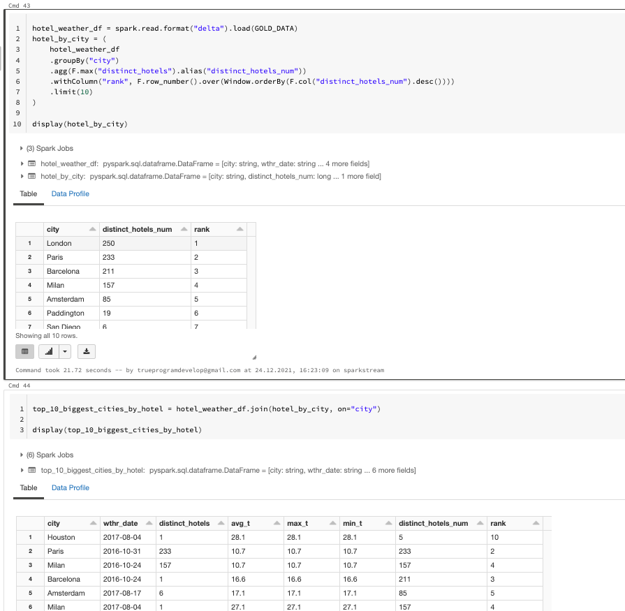
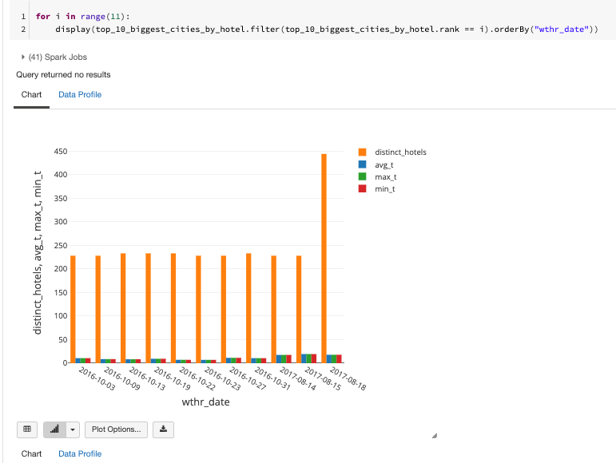

## Execution plan
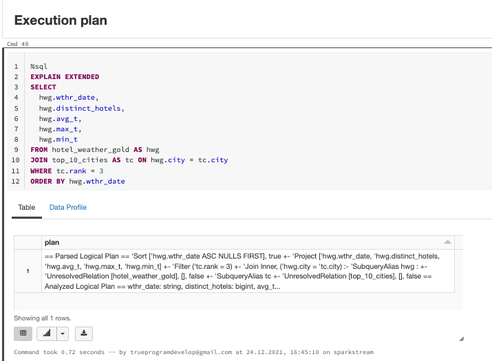

```shell
== Parsed Logical Plan ==
'Sort ['hwg.wthr_date ASC NULLS FIRST], true
+- 'Project ['hwg.wthr_date, 'hwg.distinct_hotels, 'hwg.avg_t, 'hwg.max_t, 'hwg.min_t]
   +- 'Filter ('tc.rank = 3)
      +- 'Join Inner, ('hwg.city = 'tc.city)
         :- 'SubqueryAlias hwg
         :  +- 'UnresolvedRelation [hotel_weather_gold], [], false
         +- 'SubqueryAlias tc
            +- 'UnresolvedRelation [top_10_cities], [], false

== Analyzed Logical Plan ==
wthr_date: string, distinct_hotels: bigint, avg_t: double, max_t: double, min_t: double
Sort [wthr_date#673723 ASC NULLS FIRST], true
+- Project [wthr_date#673723, distinct_hotels#673724L, avg_t#673725, max_t#673726, min_t#673727]
   +- Filter (rank#673730 = 3)
      +- Join Inner, (city#673722 = city#673728)
         :- SubqueryAlias hwg
         :  +- SubqueryAlias spark_catalog.m13sparkstreaming.hotel_weather_gold
         :     +- Relation[city#673722,wthr_date#673723,distinct_hotels#673724L,avg_t#673725,max_t#673726,min_t#673727] parquet
         +- SubqueryAlias tc
            +- SubqueryAlias spark_catalog.m13sparkstreaming.top_10_cities
               +- Relation[city#673728,num_of_hotels#673729L,rank#673730] parquet

== Optimized Logical Plan ==
Sort [wthr_date#673723 ASC NULLS FIRST], true
+- Project [wthr_date#673723, distinct_hotels#673724L, avg_t#673725, max_t#673726, min_t#673727]
   +- Join Inner, (city#673722 = city#673728)
      :- Filter isnotnull(city#673722)
      :  +- Relation[city#673722,wthr_date#673723,distinct_hotels#673724L,avg_t#673725,max_t#673726,min_t#673727] parquet
      +- Project [city#673728]
         +- Filter ((isnotnull(rank#673730) AND (rank#673730 = 3)) AND isnotnull(city#673728))
            +- Relation[city#673728,num_of_hotels#673729L,rank#673730] parquet

== Physical Plan ==
AdaptiveSparkPlan isFinalPlan=false
+- Sort [wthr_date#673723 ASC NULLS FIRST], true, 0
   +- Exchange rangepartitioning(wthr_date#673723 ASC NULLS FIRST, 200), ENSURE_REQUIREMENTS, [id=#221543]
      +- Project [wthr_date#673723, distinct_hotels#673724L, avg_t#673725, max_t#673726, min_t#673727]
         +- BroadcastHashJoin [city#673722], [city#673728], Inner, BuildRight, false
            :- Filter isnotnull(city#673722)
            :  +- FileScan parquet m13sparkstreaming.hotel_weather_gold[city#673722,wthr_date#673723,distinct_hotels#673724L,avg_t#673725,max_t#673726,min_t#673727] Batched: true, DataFilters: [isnotnull(city#673722)], Format: Parquet, Location: PreparedDeltaFileIndex[dbfs:/m13sparkstreaming_python_azure/gold/data], PartitionFilters: [], PushedFilters: [IsNotNull(city)], ReadSchema: struct<city:string,wthr_date:string,distinct_hotels:bigint,avg_t:double,max_t:double,min_t:double>
            +- BroadcastExchange HashedRelationBroadcastMode(ArrayBuffer(input[0, string, true]),false), [id=#221539]
               +- Project [city#673728]
                  +- Filter ((isnotnull(rank#673730) AND (rank#673730 = 3)) AND isnotnull(city#673728))
                     +- FileScan parquet m13sparkstreaming.top_10_cities[city#673728,rank#673730] Batched: true, DataFilters: [isnotnull(rank#673730), (rank#673730 = 3), isnotnull(city#673728)], Format: Parquet, Location: PreparedDeltaFileIndex[dbfs:/m13sparkstreaming_python_azure/gold/data/top-10-cities], PartitionFilters: [], PushedFilters: [IsNotNull(rank), EqualTo(rank,3), IsNotNull(city)], ReadSchema: struct<city:string,rank:int>
```

Inner Join to BroadcastHashJoin

